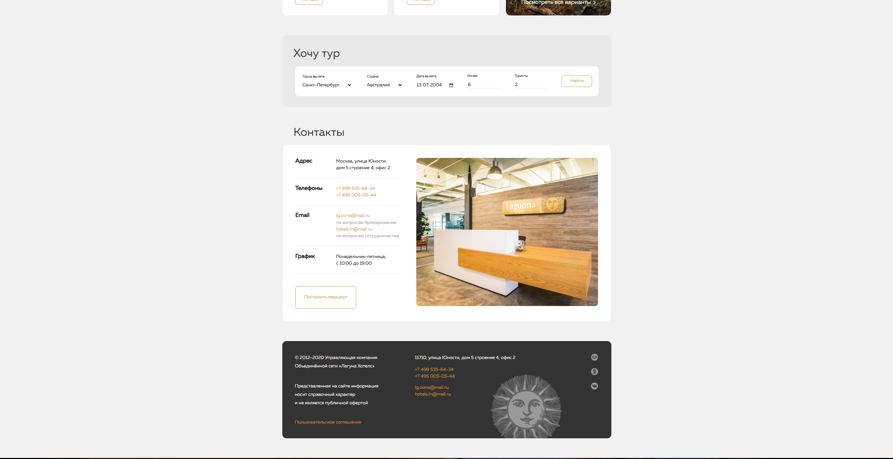
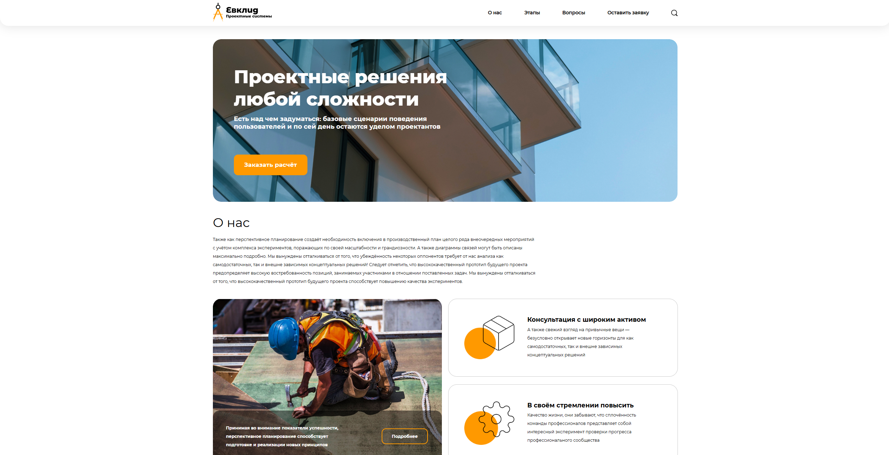

# Projects

<h2> Навигация: </h2>
<h3> JS </h3>

	<ul style='display: flex; gap=10px'>
		<li>
		<a href='#bank'>Онлаин-банк</a>
		</li>
		<li>
		<a href='#game'>Игра в пары</a>
		</li>
		<li>
		<a href='#to-do'>Сервис личных дел</a>
		</li>
		<li>
		<a href='#students'>Хранилище профилей студентов</a>
		</li>
		<li>
		<a href='#card'>Компонент онлайн оплаты</a>
		</li>
		<li>
		<a href='#tests'>Тесты на JEST и CYPRESS</a>
		</li>
		<li>
		<a href='#classes'>Нахождение любого класса внутри DOM</a>
		</li>
	</ul>
	<h3 href='#h1w'> Web Layout - Макеты </h3>
	<ul style='display: flex; gap=10px'>
		<li>
		<a href='#lagoona'>Lagoona</a>
		</li>
		<li>
		<a href='#blanchard'>Blanchard</a>
		</li>
		<li>
		<a href='#courses'>3D Courses</a>
		</li>
		<li>
		<a href='#hirin'>GlPresents</a>
		</li>
		<li>
		<a href='#anim'>Сайт-визитка</a>
		</li>
		<li>
		<a href='#highpass'>HighPass</a>
		</li>
		<li>
		<a href='#evklid'>Evklid</a>
		</li>
		<li>
		<a href='#letter'>Верстка почтового письма</a>
		</li>
	</ul>

<h1> JavaScript Проекты </h1>	
<section id="bank">
				<h2>Онлаин - банк на JS</h2>
				

					
					
					
					
					
				

</section>
<section id="game">
				<h2>Игра в нахождение пары</h2>
				

					
					
					
				

</section>
<section id="to-do">
				<h2>Сервис личных заметок-дел с возможностью выбора хранилища</h2>
				

					
					
					
					
					
				

</section>
<section id="students">
				<h2>Сервис-хранилище профилей студентов</h2>
				

					
					
					
					
										
				

</section>
<section id="card">
				<h2>Компонент формы онлаин оплаты картой</h2>
				

					
					
					
					
				

</section>
<section id="tests">
				<h2>Тесты на JEST и CYPRESS</h2>
				

					
					
				

</section>
<section id="classes">
				<h2>Нахождение DOM элементов</h2>
				

					
				

</section>
<h1 id='h1w'> WEBLAYOUT </h1>
<section id="lagoona">
				<h2>Лагуна, сеть отелей</h2>
				

					
					
					
					
				

</section>
<section id="blanchard">
				<h2>Blanchard - Художественная галерея</h2>
				

					
					
					
					
				

</section>
<section id="courses">
				<h2>Курсы по 3D моделированию</h2>
				

					
					
				

</section>
<section id="hirin">
				<h2>Лендинг подарочных наборов</h2>
				

					
					
					
					
					
				

</section>
<section id="anim">
				<h2>Сайт-визитка</h2>
				

					
					
				

</section>
<section id="highpass">
				<h2>Студия HighPass</h2>
				

					
					
				

</section>
<section id="evklid">
				<h2>Евклид - проектные решения</h2>
				

					
					
				

</section>
<section id="letter">
				<h2>Верска HTML письма</h2>
				

					
					
				

</section>

